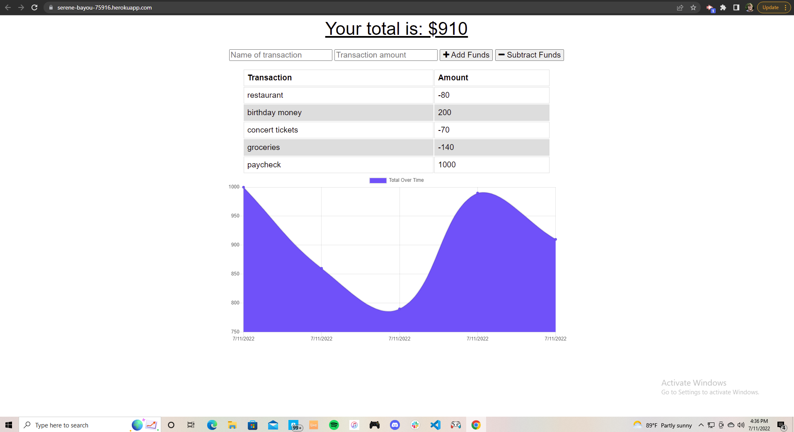

# Budget-Tracker

## Description
This application is meant to track deposits and expenses in an easy and intuiative way that allows you to visualize your finances. This app is an example of a PWA, meaning that it will still track and store the information placed into it without an internet connection. Upon reconnecting to the internet, all of the client side data will be pulled into the database.

This application has been deployed using MongoDB and Heroku.
Live app link: https://serene-bayou-75916.herokuapp.com/

## Installation
To install dependencies, navigate to the root folder and run `npm install`

## Usage
To start the server enter `npm run start`. The server will be then be active in the web browser at http://localhost:3001

## Example

## License
This application is licensed under the MIT license

## Questions
If you have any questions about this application, contact me here: [Alex-Knight](https://github.com/Alknight17)